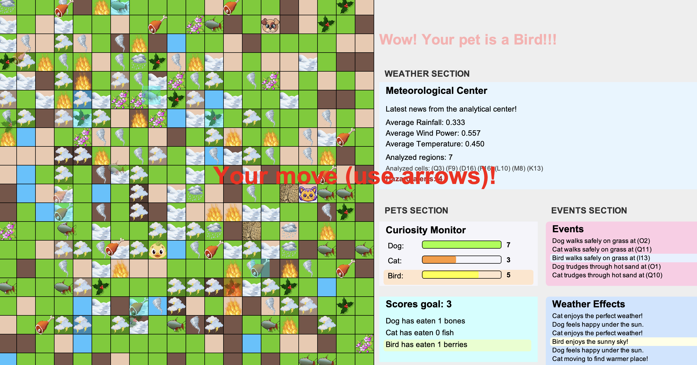
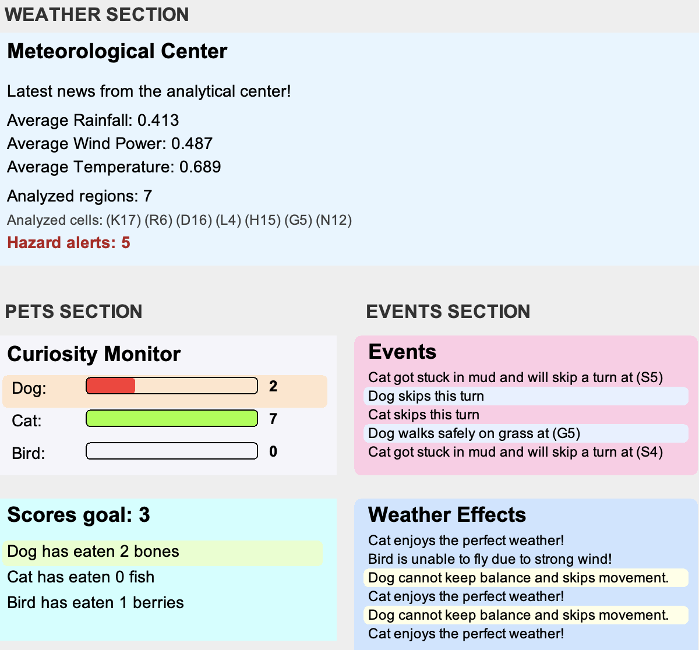
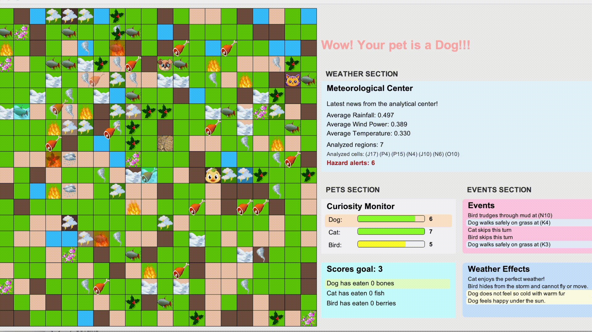

# Pets in the Grid World

A Java-based grid simulation game demonstrating real-time data streaming, modular architecture, and advanced design patterns in an interactive environment.

## Tech Stack

- **Language:** Java
- **Core Concepts:** OOP, Event-Driven Systems, Modular Architecture
- **Design Patterns:** Observer, State, Strategy
- **Data Processing:** Java Streams and Lambda Expressions
- **UI:** Java Swing / Java2D

## Demo

### Game Overview



### UI Boards



### Gameplay



## Gameplay Overview

The game takes place on a grid-based world with multiple terrain types:

**Grass, Mud, Sand, Water, and Flowers**

The player controls one pet, while two others are AI-controlled.

### Pet Types

- **Bird** → eats **berries**
- **Dog** → eats **bones**
- **Cat** → eats **fish**

### Game Goal

Be the first to collect **3 matching food items** while maintaining curiosity.

### Core Rules

- Only **Birds** can move through water
- **Mud**/**sand** may cause pets to lose turns
- **Flowers** increase curiosity
- Weather affects movement, curiosity, and visuals
- Game ends when:
  - a pet wins, or
  - all pets lose curiosity
- Press **R** to restart

## Key Features

- Procedurally generated grid world
- AI-controlled competing agents
- Real-time weather streaming (mock server)
- Dynamic weather effects on gameplay
- Forecast system with danger-zone detection

## Architecture Overview

The project is divided into five main subsystems:

### 1. Game Engine

Handles gameplay logic: movement, items, scoring, and events.

### 2. Map Generation System

Handles terrain creation and object placement.

### 3. Weather Streaming System

Handles server connection, data parsing, and state updates.

### 4. Weather Analysis System

Processes weather data to compute summaries and detect hazards.

### 5. UI System

Renders the game world, boards, and HUD elements.

## Pipeline

- **Client** → connects to server
- **WeatherFeedReader** → parses incoming data
- **WeatherManager** → groups data & updates state
- **WeatherAnalyzer** → computes averages and detects danger zones
- **WeatherStateFactory** → converts raw values into weather types

## Effects on Game

- **Cells and terrain**: visual overlays update in real time
- **Actors**: pets may lose curiosity or skip turns
- **Items**: visibility, tint, and position can change depending on weather
- **Forecast board**: analyzed weather summaries are displayed
- **Event board**: weather-related messages explain what is happening during gameplay

## Design Patterns

### Observer

- **Subject:** `WeatherManager`
- **Observers:** `Stage`, `WeatherForecastBoard`

Enables real-time updates across the system.

### State

Represents weather behaviour per cell:

Sunny, Rain, Wind, Cold, Heat, Storm

Each weather type encapsulates its own behaviour and visual logic.

### Strategy

Used for modular behaviour selection.

#### Pet Reaction Strategies

- `CatReactionStrategy`
- `DogReactionStrategy`
- `BirdReactionStrategy`

These define how each pet reacts to weather and terrain.

#### Movement Strategies

- `PlayerMoveStrategy`
- `SmartMoveStrategy`

These separate player-controlled movement from AI movement logic.

## Streams and Lambdas

Used for:

- grid processing
- weather filtering and aggregation
- dangerous zone detection
- forecast display formatting
- flexible placement and event-handling logic

This improves readability, reduces boilerplate code, and supports reusable functional-style design.

## How to run

### **Option 1**:

1. Navigate to the source code in the src folder.
2. Open the file Main.java.
3. To run program in VS Code: right-click inside the Main.java file and select "Run Java".

### **Option 2 (Terminal)**:

- cd src
- javac Main.java
- java Main

## Project Structure (Overview)

```text
src/
├─ game/ # core gameplay logic
├─ weather/ # weather system
├─ map/ # map generation
├─ ui/ # rendering & boards
└─ Main.java
```
